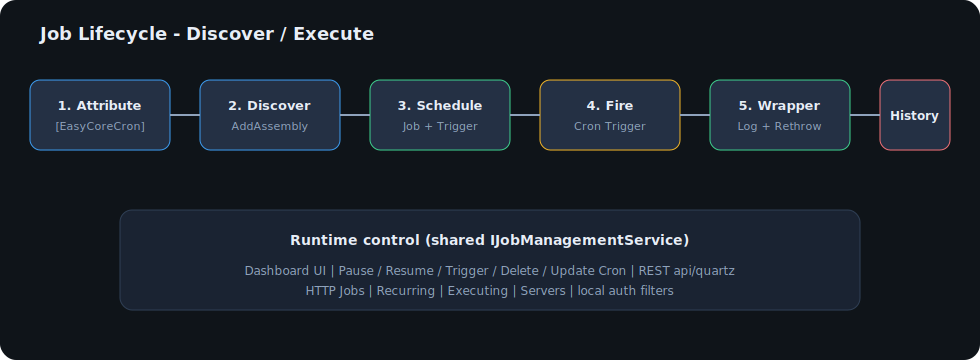
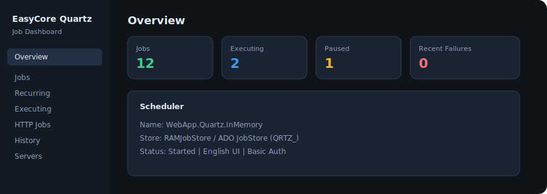

# ⏱️ EasyCore.Quartz

> **EasyCore.Quartz** is a production-oriented job scheduling library for .NET 8. Built on [Quartz.NET](https://www.quartz-scheduler.net/), it provides attribute-based jobs, an English ops dashboard, REST management APIs, dynamic HTTP jobs, and persistence with clustering for MySQL / SQL Server / PostgreSQL / Oracle.


---

## 🌍 Language

- Chinese: [README.md](README.md)
- **English (this document)**

---

## 📚 Table of Contents

### Part I — Overview & Architecture
- [1. Positioning](#1-positioning)
- [2. Architecture](#2-architecture)
- [3. NuGet Packages](#3-nuget-packages)
- [4. Database Comparison](#4-database-comparison)

### Part II — Getting Started
- [5. Requirements](#5-requirements)
- [6. Installation](#6-installation)
- [7. Quick Start (3 minutes)](#7-quick-start-3-minutes)
- [8. Attributes & Options](#8-attributes--options)

### Part III — Dashboard · REST · HTTP Jobs
- [9. Dashboard (English UI)](#9-dashboard-english-ui)
- [10. REST API](#10-rest-api)
- [11. HTTP Jobs](#11-http-jobs)

### Part IV — Persistence & Production
- [12. Database Configuration](#12-database-configuration)
- [13. Clustering & Concurrency](#13-clustering--concurrency)
- [14. Demo Projects](#14-demo-projects)
- [15. Migrating from older versions](#15-migrating-from-older-versions)
- [16. Production Checklist](#16-production-checklist)
- [17. FAQ](#17-faq)
- [18. License](#18-license)

---

## 1. Positioning

EasyCore.Quartz makes Quartz easy, operable, and production-safe in ASP.NET Core:

| Pain point | EasyCore.Quartz approach |
|---|---|
| Manual job wiring | `IEasyCoreJob` + `[EasyCoreCron]` auto-discovery |
| No ops UI | Optional package `EasyCore.Quartz.Dashboard` (`/easy-quartz`) |
| Split management APIs | Shared `IJobManagementService` (Dashboard + REST) |
| Multi-DB persistence | Separate MySQL / SQL Server / PostgreSQL / Oracle packages |
| Swallowed exceptions | `JobWrapper` logs and **rethrows** |
| Accidental public exposure | Dashboard Basic Auth; username/password required |

### 1.1 Design Principles

| Principle | Meaning |
|---|---|
| **Low friction** | One extension method + one attribute to get running |
| **Operable** | Full dashboard: Overview / Jobs / History / … |
| **Pluggable storage** | Core and DB packages are separate |
| **Failure-aware** | Exceptions propagate; History records outcomes |
| **Secure by default** | Empty authorization list ⇒ reject dashboard access |

### 1.2 Repository Layout

```text
EasyCore.Quartz/
├── src/
│   ├── EasyCore.Quartz/                 # Core: discovery, management, REST, History
│   ├── EasyCore.Quartz.Dashboard/       # English ops dashboard
│   ├── EasyCore.Quartz.MySql/
│   ├── EasyCore.Quartz.SqlServer/
│   ├── EasyCore.Quartz.PostgreSql/
│   └── EasyCore.Quartz.Oracle/
├── demo/
│   ├── WebApp.Quartz.InMemory/          # :5101 — each demo owns SampleJob
│   ├── WebApp.Quartz.MySql/             # :5102
│   ├── WebApp.Quartz.SqlServer/         # :5103
│   ├── WebApp.Quartz.PostgreSql/        # :5104
│   └── WebApp.Quartz.Oracle/            # :5105
├── tests/EasyCore.Quartz.Tests/
└── docs/svg/
```

---

## 2. Architecture

### 2.1 Component Diagram


### 2.2 Job Lifecycle



### 2.3 Data Flow

```text
[EasyCoreCron Job]
       │
       ▼
 JobTypeDiscovery ──► JobWrapper<T> ──► Quartz Scheduler
       │                                      │
       │                                      ▼
       │                            JobExecutionHistoryListener
       │                                      │
       └──────── IJobManagementService ◄──────┘
                      │
           ┌──────────┴──────────┐
           ▼                     ▼
     Dashboard UI           REST api/quartz
```

---

## 3. NuGet Packages

| Package | Role | Required |
|---|---|---|
| `EasyCore.Quartz` | Core, REST, History | ✅ |
| `EasyCore.Quartz.Dashboard` | English ops dashboard + Basic Auth | Optional |
| `EasyCore.Quartz.MySql` | MySQL store + schema bootstrap | Optional |
| `EasyCore.Quartz.SqlServer` | SQL Server store + schema bootstrap | Optional |
| `EasyCore.Quartz.PostgreSql` | PostgreSQL store + schema bootstrap | Optional |
| `EasyCore.Quartz.Oracle` | Oracle store + schema bootstrap | Optional |

---

## 4. Database Comparison

| Capability | In-Memory | MySQL | SQL Server | PostgreSQL | Oracle |
|---|---|---|---|---|---|
| Package | Core only | `.MySql` | `.SqlServer` | `.PostgreSql` | `.Oracle` |
| Persistence | ❌ | ✅ | ✅ | ✅ | ✅ |
| Clustering | ❌ | ✅ | ✅ | ✅ | ✅ |
| AutoCreateSchema | — | ✅ | ✅ | ✅ | ✅ |
| Table prefix | — | `QRTZ_` | `QRTZ_` | `QRTZ_` | `QRTZ_` |
| Typical use | Local trial | Common Linux stack | Enterprise Windows | Cloud / open source | Legacy enterprise |

### 4.1 Decision Tree

```text
Need persistence / multi-node?
├── No  → In-Memory (WebApp.Quartz.InMemory)
└── Yes → Pick your existing database
        ├── MySQL / MariaDB → EasyCore.Quartz.MySql
        ├── SQL Server → EasyCore.Quartz.SqlServer
        ├── PostgreSQL → EasyCore.Quartz.PostgreSql
        └── Oracle → EasyCore.Quartz.Oracle
```

---

## 5. Requirements

| Item | Requirement |
|---|---|
| .NET | 8.0+ |
| Host | ASP.NET Core (Web / API) |
| Quartz.NET | 3.14 (brought by core package) |
| Database | Optional; required only for persistence |

---

## 6. Installation

```bash
dotnet add package EasyCore.Quartz
dotnet add package EasyCore.Quartz.Dashboard

# pick one as needed
dotnet add package EasyCore.Quartz.MySql
dotnet add package EasyCore.Quartz.SqlServer
dotnet add package EasyCore.Quartz.PostgreSql
dotnet add package EasyCore.Quartz.Oracle
```

---

## 7. Quick Start (3 minutes)

### 7️⃣.1️⃣ Define a job

```csharp
using EasyCore.Quartz;
using Quartz;

[EasyCoreCron("0/10 * * * * ?")]
[EasyCoreDisallowConcurrentExecution]
public sealed class SampleJob : IEasyCoreJob
{
    private readonly ILogger<SampleJob> _logger;
    public SampleJob(ILogger<SampleJob> logger) => _logger = logger;

    public Task Execute(IJobExecutionContext context)
    {
        _logger.LogInformation("SampleJob running at {Time}", DateTimeOffset.Now);
        return Task.CompletedTask;
    }
}
```

Disable without deleting code:

```csharp
[EasyCoreDisableJob]
[EasyCoreCron("0 0 * * * ?")]
public sealed class DisabledJob : IEasyCoreJob
{
    public Task Execute(IJobExecutionContext context) => Task.CompletedTask;
}
```

### 7️⃣.2️⃣ Register services (including dashboard)

```csharp
// Reference EasyCore.Quartz.Dashboard
builder.Services.EasyCoreQuartz(options =>
{
    options.AddAssemblyFrom<SampleJob>();
    options.TimeZoneOffsetHours = +8;
    options.AutoCreateSchema = true;

    // RAM by default. For persistence, uncomment one:
    // options.UseMySql(m => m.ConnectionString = "...");
    // options.UseSqlServer(s => s.ConnectionString = "...");
    // options.UsePostgreSql(p => p.ConnectionString = "...");
    // options.UseOracle(o => o.ConnectionString = "...");

    // Dashboard URL = app base URL + PathMatch
    // No app.UseEasyCoreQuartzDashboard(...) needed
    options.EasyCoreQuartzDashboard(dash =>
    {
        dash.PathMatch = "/easy-quartz";
        dash.Username = "admin";
        dash.Password = "admin123";
    });
});
```

Open: `http://localhost:<port>/easy-quartz/` (browser prompts for username/password)

---

## 8. Attributes & Options

| Attribute / Option | Description |
|---|---|
| `IEasyCoreJob` | Marker interface (extends Quartz `IJob`) |
| `[EasyCoreCron]` | Cron, JobKey, JobGroup, Misfire, RequestRecovery |
| `[EasyCoreDisableJob]` | Skip auto-registration |
| `[EasyCoreDisallowConcurrentExecution]` | Prevent overlapping runs |
| `AddAssembly` / `AddAssemblyFrom<T>` | Explicit discovery |
| `AutoCreateSchema` | Idempotent DDL on startup (disable in prod) |
| `HistoryCapacity` | In-memory history size (default 200) |
| `TablePrefix` | Default `QRTZ_` (must match DDL) |
| `MaxConcurrency` | Thread pool size; `0` = auto |

---

## 9. Dashboard (English UI)

### 9.1 Preview



### 9.2 Pages

| Page | Icon | Capabilities |
|---|---|---|
| **Overview** | 📊 | Scheduler status, job/trigger counts, failure stats |
| **Jobs** | 📋 | List; Pause / Resume / Trigger / Delete / Edit Cron / Detail |
| **Recurring** | 🔁 | Cron jobs only |
| **Executing** | ⚡ | Currently running jobs |
| **HTTP Jobs** | 🌐 | Create / update HTTP invoke jobs |
| **History** | 📜 | Recent executions (node-local memory) |
| **Servers** | 🖥️ | Scheduler name / InstanceId / Store |

> ⚠️ History is a **process-local ring buffer**, not a shared cluster audit log.

### 9.3 Authorization (HTTP Basic Auth)

```csharp
options.EasyCoreQuartzDashboard(dash =>
{
    dash.PathMatch = "/easy-quartz"; // full URL = app base + this path
    dash.Username = "admin";         // required
    dash.Password = "admin123";      // required
});
```

| Option | Description |
|---|---|
| `PathMatch` | Relative path (default `/easy-quartz`) |
| `Username` / `Password` | Basic Auth credentials (required; middleware auto-mounted) |
| `BasicAuthAuthorizationFilter` | Enabled by default |
| `LocalRequestsOnlyAuthorizationFilter` | Optional; append to `dash.Authorization` |
| Custom `IEasyCoreQuartzAuthorizationFilter` | Replace or stack for production |

---

## 10. REST API

Base path: `api/quartz`

| Method | Path | Description |
|---|---|---|
| GET | `/overview` | Overview |
| GET | `/jobs` | All jobs |
| GET | `/jobs/{group}/{name}` | Job detail |
| GET | `/recurring` | Cron jobs |
| GET | `/executing` | Executing jobs |
| GET | `/history?take=100` | History |
| PUT | `/jobs/{group}/{name}/pause` | Pause |
| PUT | `/jobs/{group}/{name}/resume` | Resume |
| PUT | `/jobs/{group}/{name}/cron?cron=...` | Update cron |
| DELETE | `/jobs/{group}/{name}` | Delete |
| POST | `/jobs/{group}/{name}/trigger` | Trigger now |
| POST | `/http-jobs` | Add/update HTTP job |

---

## 11. HTTP Jobs

Create via Dashboard **HTTP Jobs** or REST:

```json
{
  "jobName": "PingApi",
  "jobGroup": "DEFAULT",
  "url": "http://localhost:5101/demo/ping",
  "method": "GET",
  "cron": "0/30 * * * * ?",
  "headers": { "X-Trace": "demo" },
  "body": "",
  "description": "Health ping"
}
```

| Capability | Notes |
|---|---|
| Method | `GET` / `POST` / `PUT` / `DELETE` / `PATCH` (case-insensitive) |
| Body | JSON validated for POST/PUT/PATCH |
| Failure | Non-2xx ⇒ exception ⇒ History failure |

---

## 12. Database Configuration

All providers use table prefix **`QRTZ_`**.

### 🐬 MySQL

```csharp
options.UseMySql(mysql =>
{
    mysql.ConnectionString =
        "server=localhost;port=3306;user id=root;password=***;database=EasyCoreQuartz;";
});
```

### 🟦 SQL Server

```csharp
options.UseSqlServer(sql =>
{
    sql.ConnectionString =
        "Server=.;Database=EasyCoreQuartz;User Id=sa;Password=***;TrustServerCertificate=True;";
});
```

### 🐘 PostgreSQL

```csharp
options.UsePostgreSql(pg =>
{
    pg.ConnectionString =
        "Host=localhost;Port=5432;Database=EasyCoreQuartz;Username=postgres;Password=***";
});
```

### 🔶 Oracle

```csharp
options.UseOracle(ora =>
{
    ora.ConnectionString =
        "User Id=quartz;Password=***;Data Source=localhost:1521/ORCL";
});
```

### Production DDL tip

```csharp
options.AutoCreateSchema = false; // disable auto DDL in production
```

Apply official Quartz scripts (or freeze scripts generated in staging) through your migration pipeline.

---

## 13. Clustering & Concurrency

| Option | Default | Description |
|---|---|---|
| `CheckinInterval` | 5s | Cluster check-in interval |
| `CheckinMisfireThreshold` | 10s | Check-in misfire threshold |
| `MaxConcurrency` | 20 | Thread pool; `0` = auto |

Configuring any persistent provider **enables Quartz clustering**.

Prevent overlapping execution:

```csharp
[EasyCoreDisallowConcurrentExecution]
[EasyCoreCron("0/5 * * * * ?")]
public sealed class ExclusiveJob : IEasyCoreJob { /* ... */ }
```

---

## 14. Demo Projects

| Project | Store | Port | Command |
|---|---|---|---|
| [`WebApp.Quartz.InMemory`](demo/WebApp.Quartz.InMemory) | RAM | 5101 | `dotnet run --project demo/WebApp.Quartz.InMemory` |
| [`WebApp.Quartz.MySql`](demo/WebApp.Quartz.MySql) | MySQL | 5102 | `dotnet run --project demo/WebApp.Quartz.MySql` |
| [`WebApp.Quartz.SqlServer`](demo/WebApp.Quartz.SqlServer) | SQL Server | 5103 | `dotnet run --project demo/WebApp.Quartz.SqlServer` |
| [`WebApp.Quartz.PostgreSql`](demo/WebApp.Quartz.PostgreSql) | PostgreSQL | 5104 | `dotnet run --project demo/WebApp.Quartz.PostgreSql` |
| [`WebApp.Quartz.Oracle`](demo/WebApp.Quartz.Oracle) | Oracle | 5105 | `dotnet run --project demo/WebApp.Quartz.Oracle` |

Each demo has its own `Jobs/SampleJob.cs` — open and edit locally, no cross-project reference.

```bash
dotnet run --project demo/WebApp.Quartz.InMemory
# open http://localhost:5101/easy-quartz
```

For DB demos, update `ConnectionStrings:Quartz` in the corresponding `appsettings.json` first.

---

## 15. Migrating from older versions

**8.0.0** is a breaking release (relative to earlier `Quarzt*` naming):

| Older | 8.0 |
|---|---|
| `QuarztOptions` | `EasyCoreQuartzOptions` |
| `api/Quarzt` | `api/quartz` |
| Typo `Quarzt` | Corrected everywhere |
| Scan all BaseDirectory DLLs | EntryAssembly + `AddAssembly` |
| Swallowed job exceptions | Log and rethrow |
| Prefix `qrtz_` | Unified `QRTZ_` |
| Mixed licenses | **MIT** |

---

## 16. Production Checklist

- [ ] Use a strong dashboard password (never ship demo credentials publicly)
- [ ] Set `AutoCreateSchema = false` with reviewed migrations
- [ ] Keep connection strings in a secret store
- [ ] Monitor logs and History failure counts
- [ ] Set `MaxConcurrency` explicitly under heavy load
- [ ] Validate cron expressions before deploy
- [ ] Multi-node setups must share the same store and table prefix

---

## 17. FAQ

**Q: Dashboard returns 401?**  
A: The browser prompts for Basic Auth. Use the configured `Username` / `Password`. Enabling the dashboard without credentials throws at startup.

**Q: Does RAM mode include the dashboard?**  
A: Yes. Reference `EasyCore.Quartz.Dashboard` and call `options.EasyCoreQuartzDashboard(...)`.

**Q: Why is History different across nodes?**  
A: History is process-local. Use your logging/audit stack for cross-node history.

**Q: Does default Method=`GET` fail validation?**  
A: No. Validation is case-insensitive in 8.0.

**Q: How do I scan only my business assembly?**  
A: `options.AddAssemblyFrom<YourJob>()` or `options.AddAssembly(asm)`.

---

## 18. License

MIT — see [LICENSE](LICENSE).

---

## 🤝 Contributing

1. Fork and create a feature branch  
2. Add tests under `tests/EasyCore.Quartz.Tests`  
3. Run `dotnet test` and `dotnet build EasyCore.Quartz.sln`  
4. Open a pull request  

Issues and PRs are welcome 🚀
